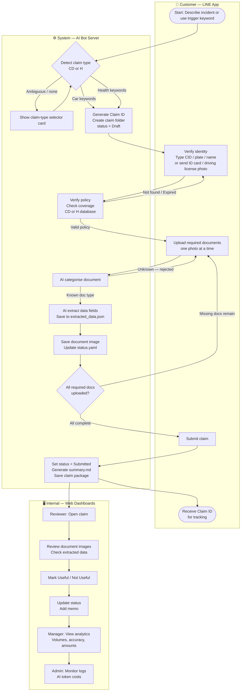
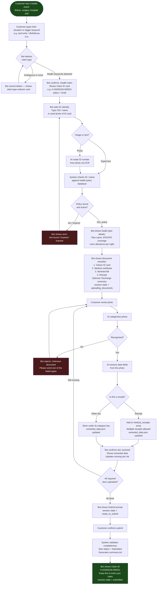
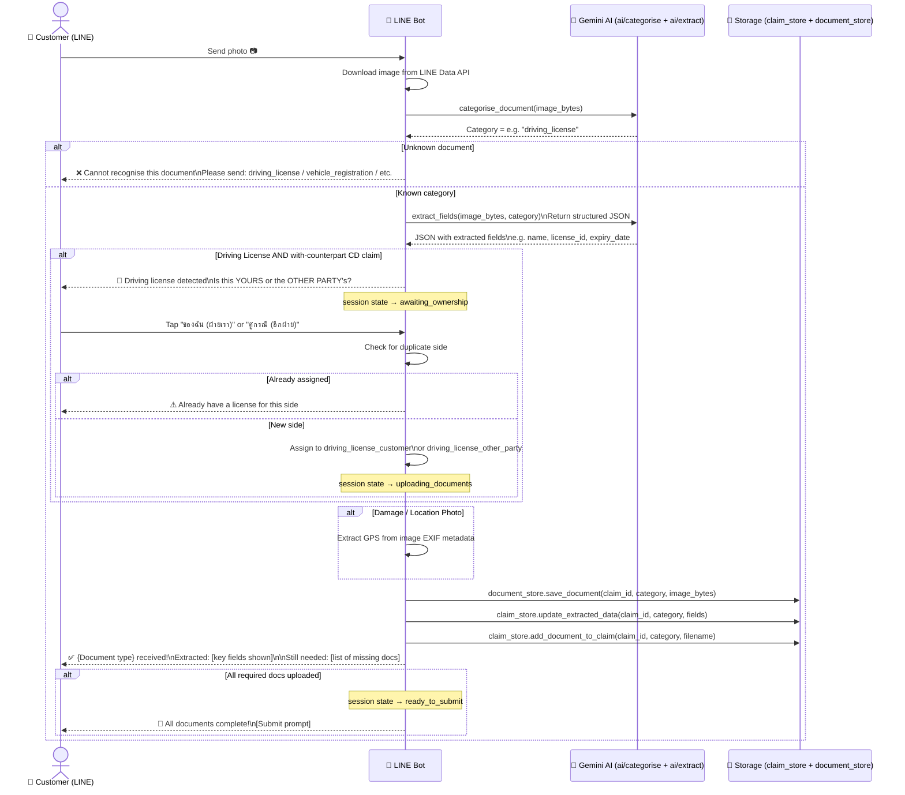
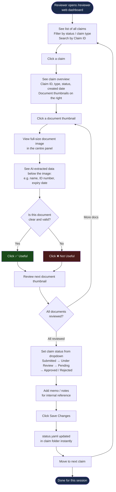
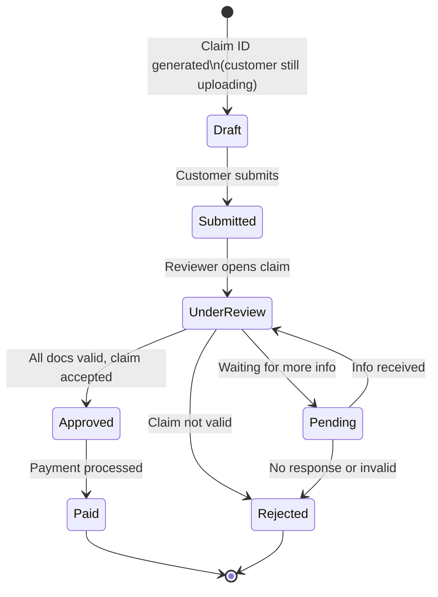
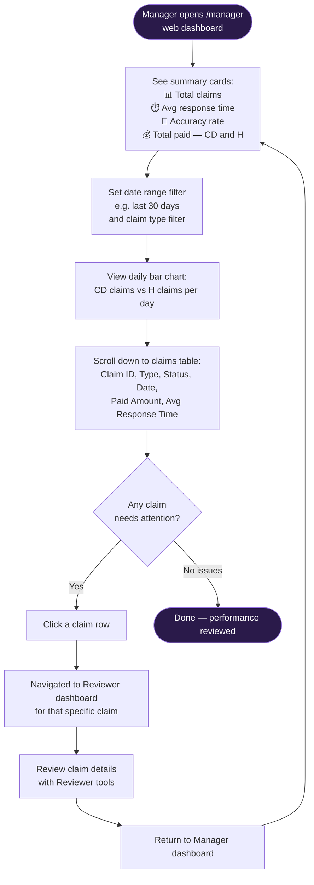
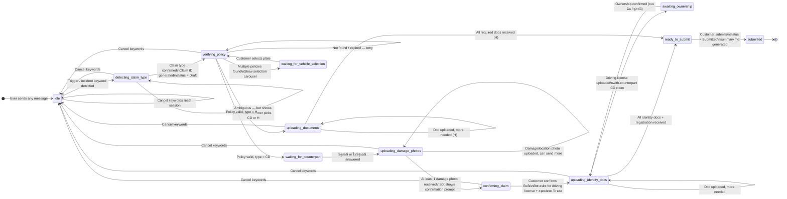

# User Journey
## LINE Insurance Claims Bot — "เช็คสิทธิ์ & เคลมประกันด่วน"

**Version:** 2.2  
**Date:** March 2026

This document shows the step-by-step journeys for all four user roles in the system.

---

## Contents

1. [System Overview — All Roles Together](#1-system-overview--all-roles-together)
2. [Customer Journey — Car Damage Claim (CD)](#2-customer-journey--car-damage-claim-cd)
3. [Customer Journey — Health Claim (H)](#3-customer-journey--health-claim-h)
4. [Document Upload & AI Extraction Loop](#4-document-upload--ai-extraction-loop-shared)
5. [Reviewer Journey](#5-reviewer-journey)
6. [Manager Journey](#6-manager-journey)
7. [Screen-by-Screen Summary](#7-screen-by-screen-summary)

---

## 1. System Overview — All Roles Together

This diagram shows how the four roles interact with the system and where their journeys connect.

```mermaid
flowchart TD
    subgraph Customer["👤 Customer — LINE App"]
        C1([Start: Describe incident or use trigger keyword])
        C2[Verify identity\nType CID / plate / name\nor send ID card / driving license photo]
        C3[Upload required documents\none photo at a time]
        C4[Submit claim]
        C5([Receive Claim ID\nfor tracking])
    end

    subgraph System["⚙️ System — AI Bot Server"]
        S1{Detect claim type\nCD or H}
        S1b[Show claim-type selector card]
        S2[Generate Claim ID\nCreate claim folder\nstatus = Draft]
        S3[Verify policy\nCheck coverage\nCD or H database]
        S4[AI categorise document]
        S5[AI extract data fields\nSave to extracted_data.json]
        S6[Save document image\nUpdate status.yaml]
        S7{All required docs\nuploaded?}
        S8[Set status = Submitted\nGenerate summary.md\nSave claim package]
    end

    subgraph Internal["🖥️ Internal — Web Dashboards"]
        R1[Reviewer: Open claim]
        R2[Review document images\nCheck extracted data]
        R3[Mark Useful / Not Useful]
        R4[Update status\nAdd memo]
        M1[Manager: View analytics\nVolumes, accuracy, amounts]
        A1[Admin: Monitor logs\nAI token costs]
    end

    C1 --> S1
    S1 -->|Car keywords| S2
    S1 -->|Health keywords| S2
    S1 -->|Ambiguous / none| S1b
    S1b --> S1
    S2 --> C2
    C2 --> S3
    S3 -->|Valid policy| C3
    S3 -->|Not found / Expired| C2
    C3 --> S4
    S4 -->|Known doc type| S5
    S4 -->|Unknown — rejected| C3
    S5 --> S6
    S6 --> S7
    S7 -->|Missing docs remain| C3
    S7 -->|All complete| C4
    C4 --> S8
    S8 --> C5
    S8 --> R1
    R1 --> R2
    R2 --> R3
    R3 --> R4
    R4 --> M1
    M1 --> A1
```

---

## 2. Customer Journey — Car Damage Claim (CD)

### Step-by-Step Flow

The CD claim uses a **phased document upload** approach. Damage photos are collected first, the customer confirms to start the claim process, then identity documents and vehicle registration are uploaded.

```mermaid
flowchart TD
    Start([Customer has a car accident\nor potential damage])

    T1[Customer opens LINE\nand types their situation or trigger keyword\ne.g. รถผมชนครับ / เช็คสิทธิ์เคลมด่วน]
    T2{Bot detects\nclaim type}
    T3[Bot cannot detect — shows\nclaim-type selector card\nCD or H button]
    T4[Bot confirms: Car Damage claim\nShows Claim ID card\ne.g. CD-20260305-000001\nstatus = Draft]

    V1[Bot asks for identity\nType CID / plate / name\nor send photo of ID card / driving license]
    V2{Image or text?}
    V3[AI reads ID / plate\nfrom photo via OCR]
    V4[System checks ID / plate / name\nagainst car policy database]
    V5{Multiple\npolicies?}
    V6[Show vehicle selection carousel\nwith all matching plates]
    V7[Customer selects their plate]
    V8{Policy found\nand active?}
    V9[Bot shows error:\nNot found / Expired / Inactive]
    V10[Bot shows policy details:\nCoverage type, amount, deductible\nvehicle details]

    Q1[Bot asks:\nมีคู่กรณีหรือไม่?\nDid another vehicle cause this?]
    Q2{Customer answers}
    Q3[Recorded: Has counterpart ✅]
    Q4[Recorded: No counterpart ❌]

    %% ── Phase 1: Damage Photos ──
    P1_1["📸 Phase 1 — Damage Photos\nBot asks for car damage photos\nsession state = uploading_damage_photos"]
    P1_2[Customer sends damage photo]
    P1_3[AI categorises photo]
    P1_4{Recognised as\ndamage/location photo?}
    P1_5[Bot rejects: Please send\na car damage photo first]
    P1_6[AI extracts damage data\nGPS from EXIF if available]
    P1_7[Bot confirms photo received\nShows damage description + severity]
    P1_8{At least 1 damage\nphoto uploaded?}

    %% ── Phase 2: Confirm Claim ──
    P2_1["✅ Phase 2 — Confirm Claim\nBot shows confirmation prompt:\nยืนยันเริ่มกระบวนการเคลม?\nConfirm to start claim process?\nsession state = confirming_claim"]
    P2_2{Customer confirms?}
    P2_3[Customer taps ยืนยัน / Confirm]

    %% ── Phase 3: Identity Docs + Registration ──
    P3_1["📄 Phase 3 — Identity Docs\nBot asks for:\n1. ใบขับขี่ Driving License\n2. สมุดเล่มทะเบียนรถ Vehicle Registration Book\nsession state = uploading_identity_docs"]
    P3_2[Customer sends photo]
    P3_3[AI categorises photo]
    P3_4{Recognised?}
    P3_5[Bot rejects: Unknown document\nPlease send driving license\nor vehicle registration book]
    P3_6[AI extracts data fields\nfrom the photo]
    P3_7{Is this a\ndriving license?}
    P3_8[Bot asks:\nIs this YOUR license or the OTHER PARTY's?\nButtons: ของฉัน / คู่กรณี\nsession state = awaiting_ownership]
    P3_9{Already uploaded\nfor this side?}
    P3_10[Bot rejects: Already have\na license for this side]
    P3_11[Bot confirms doc received\nShows extracted data\nUpdates missing doc list\nsession state = uploading_identity_docs]
    P3_12{All identity docs\n+ registration uploaded?}

    %% ── Phase 4: Submit ──
    SUB1[Bot shows Submit prompt:\nกรุณายืนยันส่งข้อมูลเคลม\nsession state = ready_to_submit]
    SUB2[Customer confirms submit]
    SUB3[System validates completeness\nSets status = Submitted\nGenerates summary.md]
    SUB4[Bot shows Claim ID\nCD-20260305-000001\nKeep this to track your claim\nsession state = submitted]

    Start --> T1
    T1 --> T2
    T2 -->|Car keywords detected| T4
    T2 -->|Ambiguous or none| T3
    T3 --> T2
    T4 --> V1

    V1 --> V2
    V2 -->|Photo| V3
    V2 -->|Typed text| V4
    V3 --> V4
    V4 --> V5
    V5 -->|Yes, multiple| V6
    V6 --> V7
    V7 --> V8
    V5 -->|Single match| V8
    V8 -->|No / Expired / Inactive| V9
    V9 --> V1
    V8 -->|Yes, active| V10
    V10 --> Q1

    Q1 --> Q2
    Q2 -->|มีคู่กรณี| Q3
    Q2 -->|ไม่มีคู่กรณี| Q4
    Q3 --> P1_1
    Q4 --> P1_1

    P1_1 --> P1_2
    P1_2 --> P1_3
    P1_3 --> P1_4
    P1_4 -->|No| P1_5
    P1_5 --> P1_2
    P1_4 -->|Yes| P1_6
    P1_6 --> P1_7
    P1_7 --> P1_8
    P1_8 -->|No, send more| P1_2
    P1_8 -->|Yes, at least 1| P2_1

    P2_1 --> P2_2
    P2_2 -->|ยืนยัน / Confirm| P2_3
    P2_3 --> P3_1

    P3_1 --> P3_2
    P3_2 --> P3_3
    P3_3 --> P3_4
    P3_4 -->|No| P3_5
    P3_5 --> P3_2
    P3_4 -->|Yes| P3_6
    P3_6 --> P3_7
    P3_7 -->|Yes, with-counterpart claim| P3_8
    P3_8 --> P3_9
    P3_9 -->|Already exists| P3_10
    P3_10 --> P3_2
    P3_9 -->|New side| P3_11
    P3_7 -->|No — other doc type| P3_11
    P3_11 --> P3_12
    P3_12 -->|Still missing| P3_2
    P3_12 -->|All done| SUB1
    SUB1 --> SUB2
    SUB2 --> SUB3
    SUB3 --> SUB4

    style Start fill:#1a4a1a,color:#fff
    style SUB4 fill:#1a4a1a,color:#fff
    style P1_5 fill:#4a1a1a,color:#fff
    style P3_5 fill:#4a1a1a,color:#fff
    style P3_10 fill:#4a1a1a,color:#fff
    style V9 fill:#4a1a1a,color:#fff
    style P1_1 fill:#1a2a4a,color:#fff
    style P2_1 fill:#2a4a1a,color:#fff
    style P3_1 fill:#1a2a4a,color:#fff
```

### Car Damage — Required Documents Checklist

| # | Phase | Document | Owner Confirmation? | Key Extracted Fields |
|:---:|:---:|---|:---:|---|
| 1 | **Phase 1** | **Vehicle Damage Photo** (≥1; stored as `vehicle_damage_photo_1`, `_2`, …) | — | Damage location, description, severity, GPS (EXIF) |
| 2 | **Phase 1** | Vehicle Location Photo *(optional)* | — | Location desc, road conditions, weather, GPS |
| 3 | **Phase 3** | **Driving License** (customer's / ใบขับขี่ผู้เอาประกัน) | ✅ "ของฉัน" | Name, license ID, citizen ID, DOB, expiry |
| 4 | **Phase 3** | **Driving License** (other party / ใบขับขี่คู่กรณี) — *with-counterpart only* | ✅ "คู่กรณี" | Name, license ID, citizen ID, DOB, expiry |
| 5 | **Phase 3** | **สมุดเล่มทะเบียนรถ / Vehicle Registration Book** | — | Plate, brand, chassis number, engine number, model year |

---

## 3. Customer Journey — Health Claim (H)

### Step-by-Step Flow

```mermaid
flowchart TD
    Start([Customer has a health event:\nillness, surgery, hospital visit])

    T1[Customer types their situation or trigger keyword\ne.g. ผมป่วยครับ / เช็คสิทธิ์เคลมด่วน]
    T2{Bot detects\nclaim type}
    T3[Bot cannot detect — shows\nclaim-type selector card]
    T4[Bot confirms: Health claim\nShows Claim ID card\ne.g. H-20260226-000021\nstatus = Draft]

    V1[Bot asks for identity\nType CID / name\nor send photo of ID card]
    V2{Image or text?}
    V3[AI reads ID number\nfrom photo via OCR]
    V4[System checks ID / name\nagainst health policy database]
    V5{Policy found\nand active?}
    V6[Bot shows error:\nNot found / Expired / Inactive]
    V7[Bot shows health plan details:\nPlan name, IPD/OPD coverage\nroom allowance per night]

    D1[Bot shows document checklist:\n1. Citizen ID card\n2. Medical certificate\n3. Itemised bill\n4. Receipt\nOptional: Discharge summary\nsession state = uploading_documents]
    D2[Customer sends photo]
    D3[AI categorises photo]
    D4{Recognised?}
    D5[Bot rejects: Unknown document\nPlease send one of the listed types]
    D6[AI extracts data fields\nfrom the photo]
    D7{Is this a receipt?}
    D8[Add to medical_receipts array\nMultiple receipts allowed\nextracted_data.json updated]
    D9[Store under its category key\nextracted_data.json updated]
    D10[Bot confirms doc received\nShows extracted data\nUpdates missing doc list]
    D11{All required\ndocs uploaded?}

    SUB1[Bot shows Submit prompt\nsession state = ready_to_submit]
    SUB2[Customer confirms submit]
    SUB3[System validates completeness\nSets status = Submitted\nGenerates summary.md]
    SUB4[Bot shows Claim ID\nH-20260226-000021\nKeep this to track your claim\nsession state = submitted]

    Start --> T1
    T1 --> T2
    T2 -->|Health keywords detected| T4
    T2 -->|Ambiguous or none| T3
    T3 --> T2
    T4 --> V1

    V1 --> V2
    V2 -->|Photo| V3
    V2 -->|Typed text| V4
    V3 --> V4
    V4 --> V5
    V5 -->|No / Expired| V6
    V6 --> V1
    V5 -->|Yes, active| V7
    V7 --> D1

    D1 --> D2
    D2 --> D3
    D3 --> D4
    D4 -->|No| D5
    D5 --> D2
    D4 -->|Yes| D6
    D6 --> D7
    D7 -->|Receipt| D8
    D8 --> D10
    D7 -->|Other doc| D9
    D9 --> D10
    D10 --> D11
    D11 -->|Still missing| D2
    D11 -->|All done| SUB1
    SUB1 --> SUB2
    SUB2 --> SUB3
    SUB3 --> SUB4

    style Start fill:#1a4a1a,color:#fff
    style SUB4 fill:#1a4a1a,color:#fff
    style D5 fill:#4a1a1a,color:#fff
    style V6 fill:#4a1a1a,color:#fff
```

### Health — Required Documents Checklist

| # | Document | Multiple? | Key Extracted Fields |
|:---:|---|:---:|---|
| 1 | **Citizen ID Card** | — | Full name (Thai + English), 13-digit ID, dates |
| 2 | **Medical Certificate** | — | Patient name, diagnosis, treatment, doctor, hospital, dates |
| 3 | **Itemised Bill** | — | Line items with amounts, total |
| 4 | **Receipt** (stored as `receipt_1`, `receipt_2`, …) | ✅ Yes | Hospital name, billing number, total paid, date, itemised amounts |
| 5 | Discharge Summary *(optional)* | — | Diagnosis, treatment, admission/discharge dates |

---

## 4. Document Upload & AI Extraction Loop (Shared)

This diagram shows what happens inside the system every time the customer sends a photo in any document upload state (`uploading_damage_photos`, `uploading_identity_docs` for CD; `uploading_documents` for H).

```mermaid
sequenceDiagram
    actor Customer as 👤 Customer (LINE)
    participant Bot as 🤖 LINE Bot
    participant AI as 🧠 Gemini AI (ai/categorise + ai/extract)
    participant Store as 💾 Storage (claim_store + document_store)

    Customer->>Bot: Send photo 📷
    Bot->>Bot: Download image from LINE Data API
    Bot->>AI: categorise_document(image_bytes)
    AI-->>Bot: Category = e.g. "driving_license"

    alt Unknown document
        Bot-->>Customer: ❌ Cannot recognise this document\nPlease send: driving_license / vehicle_registration / etc.
    else Known category
        Bot->>AI: extract_fields(image_bytes, category)\nReturn structured JSON
        AI-->>Bot: JSON with extracted fields\ne.g. name, license_id, expiry_date

        alt Driving License AND with-counterpart CD claim
            Bot-->>Customer: 🪪 Driving license detected\nIs this YOURS or the OTHER PARTY's?
            Note over Bot: session state → awaiting_ownership
            Customer->>Bot: Tap "ของฉัน (ฝ่ายเรา)" or "คู่กรณี (อีกฝ่าย)"
            Bot->>Bot: Check for duplicate side
            alt Already assigned
                Bot-->>Customer: ⚠️ Already have a license for this side
            else New side
                Bot->>Bot: Assign to driving_license_customer\nor driving_license_other_party
                Note over Bot: session state → uploading_documents
            end
        end

        alt Damage / Location Photo
            Bot->>Bot: Extract GPS from image EXIF metadata
        end

        Bot->>Store: document_store.save_document(claim_id, category, image_bytes)
        Bot->>Store: claim_store.update_extracted_data(claim_id, category, fields)
        Bot->>Store: claim_store.add_document_to_claim(claim_id, category, filename)
        Bot-->>Customer: ✅ {Document type} received!\nExtracted: [key fields shown]\n\nStill needed: [list of missing docs]

        alt All required docs uploaded
            Note over Bot: session state → ready_to_submit
            Bot-->>Customer: 🎉 All documents complete!\n[Submit prompt]
        end
    end
```

---

## 5. Reviewer Journey

The Reviewer works on a **web dashboard** (`/reviewer`). They see claims after customers submit them.

```mermaid
flowchart TD
    Start([Reviewer opens /reviewer\nweb dashboard])

    R1[See list of all claims\nFilter by status / claim type\nSearch by Claim ID]
    R2[Click a claim]
    R3[See claim overview:\nClaim ID, type, status, created date\nDocument thumbnails on the right]
    R4[Click a document thumbnail]
    R5[View full-size document image\nin the centre panel]
    R6[See AI-extracted data below the image:\ne.g. name, ID number, expiry date]
    R7{Is this document\nclear and valid?}
    R8[Click ✅ Useful]
    R9[Click ❌ Not Useful]
    R10[Review next document thumbnail]
    R11{All documents\nreviewed?}
    R12[Set claim status from dropdown\nSubmitted → Under Review → Pending\n→ Approved / Rejected]
    R13[Add memo / notes\nfor internal reference]
    R14[Click Save Changes]
    R15[status.yaml updated\nin claim folder instantly]
    R16[Move to next claim]
    End([Done for this session])

    Start --> R1
    R1 --> R2
    R2 --> R3
    R3 --> R4
    R4 --> R5
    R5 --> R6
    R6 --> R7
    R7 -->|Yes| R8
    R7 -->|No| R9
    R8 --> R10
    R9 --> R10
    R10 --> R11
    R11 -->|More docs| R4
    R11 -->|All reviewed| R12
    R12 --> R13
    R13 --> R14
    R14 --> R15
    R15 --> R16
    R16 --> R1
    R16 --> End

    style Start fill:#1a2a4a,color:#fff
    style End fill:#1a2a4a,color:#fff
    style R8 fill:#1a4a1a,color:#fff
    style R9 fill:#4a1a1a,color:#fff
```

### Reviewer Status Workflow

Valid transitions are enforced by `constants.VALID_TRANSITIONS`:

```mermaid
stateDiagram-v2
    [*] --> Draft : Claim ID generated\n(customer still uploading)
    Draft --> Submitted : Customer submits
    Submitted --> UnderReview : Reviewer opens claim
    UnderReview --> Pending : Waiting for more info
    UnderReview --> Approved : All docs valid, claim accepted
    UnderReview --> Rejected : Claim not valid
    Pending --> UnderReview : Info received
    Pending --> Rejected : No response or invalid
    Approved --> Paid : Payment processed
    Paid --> [*]
    Rejected --> [*]
```

---

## 6. Manager Journey

The Manager works on a **web dashboard** (`/manager`) to monitor overall performance.

```mermaid
flowchart TD
    Start([Manager opens /manager\nweb dashboard])

    M1[See summary cards:\n📊 Total claims\n⏱️ Avg response time\n🎯 Accuracy rate\n💰 Total paid — CD and H]
    M2[Set date range filter\ne.g. last 30 days\nand claim type filter]
    M3[View daily bar chart:\nCD claims vs H claims per day]
    M4[Scroll down to claims table:\nClaim ID, Type, Status, Date,\nPaid Amount, Avg Response Time]
    M5{Any claim\nneeds attention?}
    M6[Click a claim row]
    M7[Navigated to Reviewer dashboard\nfor that specific claim]
    M8[Review claim details\nwith Reviewer tools]
    M9[Return to Manager dashboard]
    End([Done — performance reviewed])

    Start --> M1
    M1 --> M2
    M2 --> M3
    M3 --> M4
    M4 --> M5
    M5 -->|Yes| M6
    M6 --> M7
    M7 --> M8
    M8 --> M9
    M9 --> M1
    M5 -->|No issues| End

    style Start fill:#2a1a4a,color:#fff
    style End fill:#2a1a4a,color:#fff
```

### How Manager Metrics Are Calculated

| Metric | Calculation |
|---|---|
| **Total Claims** | Count of all claim folders in `{DATA_DIR}/claims/` |
| **Average Response Time** | Mean of `response_times_ms` from all `status.yaml` metrics |
| **Accuracy Rate** | Useful documents ÷ (Useful + Not Useful) × 100 |
| **Total Paid Amount (CD)** | Sum of `total_paid_amount` for Car Damage claims with status = "Paid" |
| **Total Paid Amount (H)** | Sum of `total_paid_amount` for Health claims with status = "Paid" |

---

## 7. Screen-by-Screen Summary

### Customer Screens (LINE Chat)

| # | Screen / Message | Trigger | Content |
|:---:|---|---|---|
| 1 | **Claim ID Confirmed** | Trigger keyword or incident keywords | Bot confirms claim type; shows generated Claim ID; status set to Draft |
| 2 | **Identity Request** | Claim type confirmed | Ask for 13-digit CID / plate / name, or ID card photo |
| 3 | **Vehicle Selection** (CD, if multiple) | Multiple policies found | Carousel of matching plates; customer selects their vehicle |
| 4 | **Policy Details Card** | ID verified (CD) | Shows coverage type, amount, deductible, vehicle info |
| 5 | **Health Policy Details Card** | ID verified (H) | Shows plan name, IPD/OPD coverage, room allowance |
| 6 | **Counterpart Question** (CD only) | Policy shown | Quick-reply buttons: มีคู่กรณี / ไม่มีคู่กรณี |
| 7 | **📸 Damage Photo Request** (CD, Phase 1) | Counterpart answered | Bot asks customer to send car damage photos first |
| 8 | **Damage Photo Acknowledgement** (CD, Phase 1) | Damage/location photo received | Confirms damage photo received; shows damage description, severity, GPS |
| 9 | **✅ Claim Confirmation Prompt** (CD, Phase 2) | ≥1 damage photo uploaded | Bot shows: "ยืนยันเริ่มกระบวนการเคลม? / Confirm to start claim process?" with ยืนยัน button |
| 10 | **📄 Identity Doc Request** (CD, Phase 3) | Customer confirms claim | Bot asks for: ใบขับขี่ (driving license) + สมุดเล่มทะเบียนรถ (vehicle registration book) |
| 11 | **Document Checklist** (H) | Policy shown (H) | Full list of required and optional documents |
| 12 | **Upload Acknowledgement** | Each identity doc / H doc received | Confirms document category; shows extracted data fields |
| 13 | **Ownership Confirmation** (CD, driving license, with-counterpart) | Driving license detected | Quick-reply: ของฉัน (ฝ่ายเรา) / คู่กรณี (อีกฝ่าย) |
| 14 | **Progress Update** | After each upload | Shows remaining required documents |
| 15 | **Submit Prompt** | All docs complete | Submit button; shows total doc count and Claim ID |
| 16 | **Submission Confirmed** | Submit successful | Shows Claim ID; instructions to contact for status updates |

### Reviewer Screens (Web `/reviewer`)

| # | Area | Content |
|:---:|---|---|
| 1 | **Left panel** | Claim list with search, status filter, type filter |
| 2 | **Right panel** | Document thumbnails for selected claim |
| 3 | **Centre panel** | Full-size document image + AI-extracted data |
| 4 | **Action buttons** | ✅ Useful / ❌ Not Useful per document |
| 5 | **Status section** | Dropdown (valid transitions only) + memo textarea + Save Changes |

### Manager Screens (Web `/manager`)

| # | Area | Content |
|:---:|---|---|
| 1 | **Summary cards** | Total claims, avg response time, accuracy rate, paid amounts (CD + H) |
| 2 | **Date + type filter** | Date range picker and claim type selector |
| 3 | **Daily chart** | Bar chart: CD and H claim counts per day |
| 4 | **Claims table** | Claim ID, type, status, created date, paid amount, avg response time |

---

## Appendix: State Machine — Customer Session

Each customer has one session tracked by their LINE user ID. The session moves through these states, driven by `handle_text_message` and `handle_image_message` in `main.py` (legacy flow) and the `handlers/` modules (v2 flow):

```mermaid
stateDiagram-v2
    direction LR
    [*] --> idle : User sends any message
    idle --> detecting_claim_type : Trigger / incident keyword detected
    detecting_claim_type --> verifying_policy : Claim type confirmed\nClaim ID generated\nstatus = Draft
    detecting_claim_type --> detecting_claim_type : Ambiguous — bot shows selector\ncustomer picks CD or H
    verifying_policy --> waiting_for_counterpart : Policy valid, type = CD
    verifying_policy --> uploading_documents : Policy valid, type = H
    verifying_policy --> verifying_policy : Not found / expired — retry
    waiting_for_vehicle_selection --> verifying_policy : Customer selects plate
    verifying_policy --> waiting_for_vehicle_selection : Multiple policies found\nShow selection carousel
    waiting_for_counterpart --> uploading_damage_photos : มีคู่กรณี or ไม่มีคู่กรณี answered
    uploading_damage_photos --> uploading_damage_photos : Damage/location photo uploaded, can send more
    uploading_damage_photos --> confirming_claim : At least 1 damage photo received\nBot shows confirmation prompt
    confirming_claim --> uploading_identity_docs : Customer confirms ยืนยัน\nBot asks for driving license + สมุดเล่มทะเบียนรถ
    uploading_identity_docs --> uploading_identity_docs : Doc uploaded, more needed
    uploading_identity_docs --> awaiting_ownership : Driving license uploaded\nwith-counterpart CD claim
    awaiting_ownership --> uploading_identity_docs : Ownership confirmed (ของฉัน / คู่กรณี)
    uploading_identity_docs --> ready_to_submit : All identity docs + registration received
    uploading_documents --> uploading_documents : Doc uploaded, more needed (H)
    uploading_documents --> ready_to_submit : All required docs received (H)
    ready_to_submit --> submitted : Customer submits\nstatus = Submitted\nsummary.md generated
    submitted --> [*]
    idle --> idle : Cancel keywords reset session
    detecting_claim_type --> idle : Cancel keywords
    verifying_policy --> idle : Cancel keywords
    uploading_damage_photos --> idle : Cancel keywords
    confirming_claim --> idle : Cancel keywords
    uploading_identity_docs --> idle : Cancel keywords
    uploading_documents --> idle : Cancel keywords
```

### Session State Reference

| State | Description | Next Actions |
|---|---|---|
| `idle` | Default state; no active claim | Any message → trigger detection |
| `detecting_claim_type` | Evaluating keywords; may show selector | Pick CD or H → `verifying_policy` |
| `verifying_policy` | Awaiting CID / plate / name / ID photo | Valid policy → counterpart Q (CD) or docs (H) |
| `waiting_for_vehicle_selection` | Multiple policies found; customer picks plate | Plate selected → `verifying_policy` |
| `waiting_for_counterpart` | CD only: asking มีคู่กรณี / ไม่มีคู่กรณี | Answer → `uploading_damage_photos` |
| `uploading_damage_photos` | **CD only, Phase 1:** Accepting car damage and location photos | ≥1 damage photo → `confirming_claim` |
| `confirming_claim` | **CD only, Phase 2:** Confirmation prompt shown; awaiting ยืนยัน | Confirm → `uploading_identity_docs` |
| `uploading_identity_docs` | **CD only, Phase 3:** Accepting driving license(s) + สมุดเล่มทะเบียนรถ | All done → `ready_to_submit`; license → `awaiting_ownership` |
| `uploading_documents` | **H only:** Document upload loop; AI categorise + extract | Upload done → `ready_to_submit` |
| `awaiting_ownership` | Driving license received; asking ของฉัน / คู่กรณี | Confirm → `uploading_identity_docs` |
| `ready_to_submit` | All required docs received; Submit button shown | Submit → `submitted` |
| `submitted` | Claim submitted; Claim ID shown | Session ends (or restart) |

---

*Related documents: [business-requirement.md](business-requirement.md) · [tech-spec.md](tech-spec.md) · [document-verify.md](document-verify.md)*
