# User Journey
## LINE Insurance Claims Bot — "เช็คสิทธิ์ & เคลมประกันด่วน"

**Version:** 2.0  
**Date:** February 2026

This document shows the step-by-step journeys for all four user roles in the system.

---

## Contents

1. [System Overview — All Roles Together](#1-system-overview--all-roles-together)
2. [Customer Journey — Car Damage Claim (CD)](#2-customer-journey--car-damage-claim-cd)
3. [Customer Journey — Health Claim (H)](#3-customer-journey--health-claim-h)
4. [Document Upload & AI Extraction Loop](#4-document-upload--ai-extraction-loop-shared)
5. [Reviewer Journey](#5-reviewer-journey)
6. [Manager Journey](#6-manager-journey)
7. [Screen-by-Screen Summary](#7-screen-by-screen-summary)

---

## 1. System Overview — All Roles Together

This diagram shows how the four roles interact with the system and where their journeys connect.

```mermaid
flowchart TD
    subgraph Customer["👤 Customer — LINE App"]
        C1([Start: Describe incident\nor type เช็คสิทธิ์เคลมด่วน])
        C2[Verify identity\nType ID or send ID photo]
        C3[Upload required documents\none photo at a time]
        C4[Submit claim]
        C5([Receive Claim ID\nfor tracking])
    end

    subgraph System["⚙️ System — AI Bot Server"]
        S1{Detect claim type\nCD or H}
        S2[Generate Claim ID\nCreate claim folder]
        S3[Verify policy\nCheck coverage]
        S4[AI categorise document]
        S5[AI extract data fields\nSave to extracted_data.json]
        S6[Save document image\nUpdate status.yaml]
        S7{All required docs\nuploaded?}
        S8[Set status = Submitted\nSave claim package]
    end

    subgraph Internal["🖥️ Internal — Web Dashboards"]
        R1[Reviewer: Open claim]
        R2[Review document images\nCheck extracted data]
        R3[Mark Useful / Not Useful]
        R4[Update status\nAdd memo]
        M1[Manager: View analytics\nVolumes, accuracy, amounts]
        A1[Admin: Monitor logs\nAI token costs]
    end

    C1 --> S1
    S1 -->|Car Damage| S2
    S1 -->|Health| S2
    S1 -->|Cannot detect| C1
    S2 --> C2
    C2 --> S3
    S3 -->|Valid policy| C3
    S3 -->|Not found / Expired| C2
    C3 --> S4
    S4 -->|Known doc type| S5
    S4 -->|Unknown — rejected| C3
    S5 --> S6
    S6 --> S7
    S7 -->|Missing docs remain| C3
    S7 -->|All complete| C4
    C4 --> S8
    S8 --> C5
    S8 --> R1
    R1 --> R2
    R2 --> R3
    R3 --> R4
    R4 --> M1
    M1 --> A1
```

---

## 2. Customer Journey — Car Damage Claim (CD)

### Step-by-Step Flow

```mermaid
flowchart TD
    Start([Customer has a car accident\nor potential damage])

    T1[Customer opens LINE\nand types their situation\ne.g. รถผมชนครับ / My car was hit]
    T2{Bot detects\nclaim type}
    T3[Bot cannot detect — asks\nIs this Car or Health claim?]
    T4[Bot confirms: Car Damage claim\nGenerates Claim ID\ne.g. CD-20260226-000001]

    V1[Bot asks for identity\nType 13-digit ID\nor send photo of ID card / driving license]
    V2{Image or text?}
    V3[AI reads ID number\nfrom photo via OCR]
    V4[System checks ID\nagainst policy database]
    V5{Policy found\nand active?}
    V6[Bot shows error:\nNot found / Expired / Inactive]
    V7[Bot shows policy details:\nCoverage type, amount, deductible\nvehicle details]

    Q1[Bot asks:\nมีคู่กรณีหรือไม่?\nDid another vehicle cause this?]
    Q2{Customer answers}
    Q3[Recorded: Has counterpart ✅]
    Q4[Recorded: No counterpart ❌]

    D1[Bot lists required documents:\n1. Your driving license\n2. Other party driving license\n3. Vehicle registration\n4. Damage photo\nOptional: Location photo]
    D2[Customer sends photo]
    D3[AI categorises photo]
    D4{Recognised?}
    D5[Bot rejects: Unknown document\nPlease send one of the listed types]
    D6[AI extracts data fields\nfrom the photo]
    D7{Is this a\ndriving license?}
    D8[Bot asks:\nIs this YOUR license or the OTHER PARTY's?\nButtons: ของฉัน / คู่กรณี]
    D9{Already uploaded\nfor this side?}
    D10[Bot rejects: Already have\na license for this side]
    D11[Bot confirms which doc was uploaded\nShows extracted data to customer\nUpdates missing doc list]
    D12{All required\ndocs uploaded?}

    I1[Bot shows eligibility verdict\nBased on damage photo + policy\n🟢 Eligible / 🟡 Check excess / 🔴 Not eligible]
    I2[Bot prompts:\nOptional: describe the incident]
    I3[Customer types description or skips]

    SUB1[Bot shows Submit button\nor prompts to submit]
    SUB2[Customer submits]
    SUB3[System sets status = Submitted\nSaves full claim package]
    SUB4[Bot shows Claim ID\nCD-20260226-000001\nKeep this to track your claim]

    Start --> T1
    T1 --> T2
    T2 -->|Car keywords detected| T4
    T2 -->|Unclear| T3
    T3 --> T2
    T4 --> V1

    V1 --> V2
    V2 -->|Photo| V3
    V2 -->|Typed number| V4
    V3 --> V4
    V4 --> V5
    V5 -->|No / Expired| V6
    V6 --> V1
    V5 -->|Yes, active| V7
    V7 --> Q1

    Q1 --> Q2
    Q2 -->|มีคู่กรณี| Q3
    Q2 -->|ไม่มีคู่กรณี| Q4
    Q3 --> D1
    Q4 --> D1

    D1 --> D2
    D2 --> D3
    D3 --> D4
    D4 -->|No| D5
    D5 --> D2
    D4 -->|Yes| D6
    D6 --> D7
    D7 -->|Yes| D8
    D8 --> D9
    D9 -->|Already exists| D10
    D10 --> D2
    D9 -->|New side| D11
    D7 -->|No — other doc type| D11
    D11 --> D12
    D12 -->|Still missing| D2

    D12 -->|All done| I1
    I1 --> I2
    I2 --> I3
    I3 --> SUB1
    SUB1 --> SUB2
    SUB2 --> SUB3
    SUB3 --> SUB4

    style Start fill:#1a4a1a,color:#fff
    style SUB4 fill:#1a4a1a,color:#fff
    style D5 fill:#4a1a1a,color:#fff
    style D10 fill:#4a1a1a,color:#fff
    style V6 fill:#4a1a1a,color:#fff
    style I1 fill:#1a2a4a,color:#fff
```

### Car Damage — Required Documents Checklist

| # | Document | Owner Confirmation? | Key Extracted Fields |
|:---:|---|:---:|---|
| 1 | **Driving License** (customer's) | ✅ "ของฉัน" | Name, license ID, citizen ID, DOB, expiry |
| 2 | **Driving License** (other party) | ✅ "คู่กรณี" | Name, license ID, citizen ID, DOB, expiry |
| 3 | **Vehicle Registration** | — | Plate, brand, chassis number, engine number, model year |
| 4 | **Vehicle Damage Photo** (≥1) | — | Damage location, description, severity, GPS |
| 5 | Vehicle Location Photo *(optional)* | — | Location desc, road conditions, weather, GPS |

---

## 3. Customer Journey — Health Claim (H)

### Step-by-Step Flow

### Health — Required Documents Checklist

| # | Document | Multiple? | Key Extracted Fields |
|:---:|---|:---:|---|
| 1 | **Citizen ID Card** | — | Full name (Thai + English), 13-digit ID, dates |
| 2 | **Medical Certificate** | — | Patient name, diagnosis, treatment, doctor, hospital, dates |
| 3 | **Itemised Bill** | — | Line items with amounts, total |
| 4 | **Receipt** | ✅ Yes | Hospital name, billing number, total paid, date, itemised amounts |
| 5 | Discharge Summary *(optional)* | — | Diagnosis, treatment, admission/discharge dates |

---

## 4. Document Upload & AI Extraction Loop (Shared)

This diagram shows what happens inside the system every time the customer sends a photo.

```mermaid
sequenceDiagram
    actor Customer as 👤 Customer (LINE)
    participant Bot as 🤖 LINE Bot
    participant AI as 🧠 AI Vision Model
    participant Store as 💾 Storage (Persistent Volume)

    Customer->>Bot: Send photo 📷
    Bot->>Bot: Download image from LINE Data API
    Bot->>AI: Categorise this image\n(What document type is it?)
    AI-->>Bot: Category = e.g. "driving_license"

    alt Unknown document
        Bot-->>Customer: ❌ Cannot recognise this document\nPlease send: driving_license / vehicle_registration / etc.
    else Known category
        Bot->>AI: Extract data fields from this {category}\nReturn structured JSON
        AI-->>Bot: JSON with extracted fields\ne.g. name, license_id, expiry_date

        alt Driving License (Car Damage only)
            Bot-->>Customer: 🪪 Driving license detected\nIs this YOURS or the OTHER PARTY's?
            Customer->>Bot: Tap "ของฉัน" or "คู่กรณี"
            Bot->>Bot: Assign to driving_license_customer\nor driving_license_other_party
        end

        alt Damage / Location Photo
            Bot->>Bot: Extract GPS from image EXIF metadata
        end

        Bot->>Store: Save image file\n{category}_{timestamp}.jpg
        Bot->>Store: Merge extracted fields into\nextracted_data.json
        Bot->>Store: Update document list in status.yaml
        Bot-->>Customer: ✅ {Document type} received!\nExtracted: [key fields shown]\n\nStill needed: [list of missing docs]
    end
```

---

## 5. Reviewer Journey

The Reviewer works on a **web dashboard** (not LINE). They see claims after customers submit them.

```mermaid
flowchart TD
    Start([Reviewer opens /reviewer\nweb dashboard])

    R1[See list of all submitted claims\nFilter by status / claim type\nSearch by Claim ID]
    R2[Click a claim]
    R3[See claim overview:\nClaim ID, type, status, created date\nDocument thumbnails on the right]
    R4[Click a document thumbnail]
    R5[View full-size document image\nin the centre panel]
    R6[See AI-extracted data below the image:\ne.g. name, ID number, expiry date]
    R7{Is this document\nclear and valid?}
    R8[Click ✅ Useful]
    R9[Click ❌ Not Useful]
    R10[Review next document thumbnail]
    R11{All documents\nreviewed?}
    R12[Set claim status from dropdown:\nUnder Review → Pending → Approved\nor Rejected]
    R13[Add memo / notes\nfor internal reference]
    R14[Click Save Changes]
    R15[status.yaml updated\nin claim folder]
    R16[Move to next claim]
    End([Done for this session])

    Start --> R1
    R1 --> R2
    R2 --> R3
    R3 --> R4
    R4 --> R5
    R5 --> R6
    R6 --> R7
    R7 -->|Yes| R8
    R7 -->|No| R9
    R8 --> R10
    R9 --> R10
    R10 --> R11
    R11 -->|More docs| R4
    R11 -->|All reviewed| R12
    R12 --> R13
    R13 --> R14
    R14 --> R15
    R15 --> R16
    R16 --> R1
    R16 --> End

    style Start fill:#1a2a4a,color:#fff
    style End fill:#1a2a4a,color:#fff
    style R8 fill:#1a4a1a,color:#fff
    style R9 fill:#4a1a1a,color:#fff
```

### Reviewer Status Workflow

---

## 6. Manager Journey

The Manager works on a **web dashboard** to monitor overall performance.

```mermaid
flowchart TD
    Start([Manager opens /manager\nweb dashboard])

    M1[See summary cards:\n📊 Total claims\n⏱️ Avg response time\n🎯 Accuracy rate\n💰 Total paid — CD and H]
    M2[Set date range filter\ne.g. last 30 days\nand claim type filter]
    M3[View daily bar chart:\nCD claims vs H claims per day]
    M4[Scroll down to claims table:\nClaim ID, Type, Status, Date,\nPaid Amount, Avg Response Time]
    M5{Any claim\nneeds attention?}
    M6[Click a claim row]
    M7[Navigated to Reviewer dashboard\nfor that specific claim]
    M8[Review claim details\nwith Reviewer tools]
    M9[Return to Manager dashboard]
    End([Done — performance reviewed])

    Start --> M1
    M1 --> M2
    M2 --> M3
    M3 --> M4
    M4 --> M5
    M5 -->|Yes| M6
    M6 --> M7
    M7 --> M8
    M8 --> M9
    M9 --> M1
    M5 -->|No issues| End

    style Start fill:#2a1a4a,color:#fff
    style End fill:#2a1a4a,color:#fff
```

### How Manager Metrics Are Calculated

| Metric | Calculation |
|---|---|
| **Total Claims** | Count of all claim records in storage |
| **Average Response Time** | Mean of `response_times_ms` from all claim metrics |
| **Accuracy Rate** | Useful documents ÷ (Useful + Not Useful) × 100 |
| **Total Paid Amount (CD)** | Sum of `total_paid_amount` for Car Damage claims with status = "Paid" |
| **Total Paid Amount (H)** | Sum of `total_paid_amount` for Health claims with status = "Paid" |

---

## 7. Screen-by-Screen Summary

### Customer Screens (LINE Chat)

| # | Screen / Message | Trigger | Content |
|:---:|---|---|---|
| 1 | **Welcome + Claim Type Confirm** | Trigger keyword or "เช็คสิทธิ์" | Bot confirms claim type; shows generated Claim ID |
| 2 | **Identity Request** | Claim type confirmed | Ask for 13-digit ID or ID card photo |
| 3 | **Policy Details Card** | ID verified | Shows coverage type, amount, deductible, vehicle/plan info |
| 4 | **Counterpart Question** (CD only) | Policy shown | Quick-reply buttons: มีคู่กรณี / ไม่มีคู่กรณี |
| 5 | **Document Checklist** | Counterpart answered (CD) or Policy shown (H) | List of required and optional documents |
| 6 | **Upload Acknowledgement** | Each photo received | Confirms document type recognised; shows extracted data |
| 7 | **Ownership Confirmation** (CD, driving license) | Driving license detected | Quick-reply: ของฉัน / คู่กรณี |
| 8 | **Progress Update** | After each upload | X of Y documents received; what's still missing |
| 9 | **Eligibility Verdict** (CD) | Damage photo analysed | 🟢 / 🟡 / 🔴 verdict with explanation and disclaimer |
| 10 | **Submit Prompt** | All docs complete | Prompt to submit; shows final document count |
| 11 | **Submission Confirmed** | Submit successful | Shows Claim ID; instructions to contact for status |

### Reviewer Screens (Web)

| # | Area | Content |
|:---:|---|---|
| 1 | **Left panel** | Claim list with search, status filter, type filter |
| 2 | **Right panel** | Document thumbnails for selected claim |
| 3 | **Centre panel** | Full-size document image + AI-extracted data |
| 4 | **Action buttons** | ✅ Useful / ❌ Not Useful per document |
| 5 | **Status section** | Dropdown + memo textarea + Save Changes button |

### Manager Screens (Web)

| # | Area | Content |
|:---:|---|---|
| 1 | **Summary cards** | Total claims, avg response time, accuracy rate, paid amounts |
| 2 | **Date + type filter** | Date range picker and claim type selector |
| 3 | **Daily chart** | Bar chart: CD and H claim counts per day |
| 4 | **Claims table** | Claim ID, type, status, created, paid amount, avg response time |

---

## Appendix: State Machine — Customer Session

Each customer has one session tracked by their LINE user ID. The session moves through these states:

```mermaid
stateDiagram-v2
    direction LR
    [*] --> idle : User sends any message
    idle --> detecting_claim_type : Message received
    detecting_claim_type --> verifying_policy : Claim type detected
    detecting_claim_type --> detecting_claim_type : Unclear — bot asks again
    verifying_policy --> waiting_for_counterpart : Policy valid (CD)
    verifying_policy --> uploading_documents : Policy valid (H)
    verifying_policy --> verifying_policy : Not found / expired
    waiting_for_counterpart --> uploading_documents : Counterpart answered
    uploading_documents --> uploading_documents : Doc uploaded, more needed
    uploading_documents --> awaiting_ownership : Driving license uploaded (CD)
    awaiting_ownership --> uploading_documents : Ownership confirmed
    uploading_documents --> ready_to_submit : All required docs received
    ready_to_submit --> submitted : Customer submits
    submitted --> [*]
    idle --> detecting_claim_type : Cancel keywords reset session
```

---

*Related documents: [business-requirement.md](business-requirement.md) · [tech-spec.md](tech-spec.md) · [document-verify.md](document-verify.md)*
